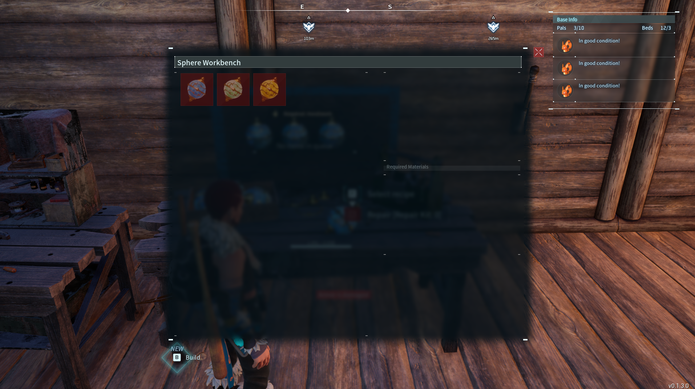
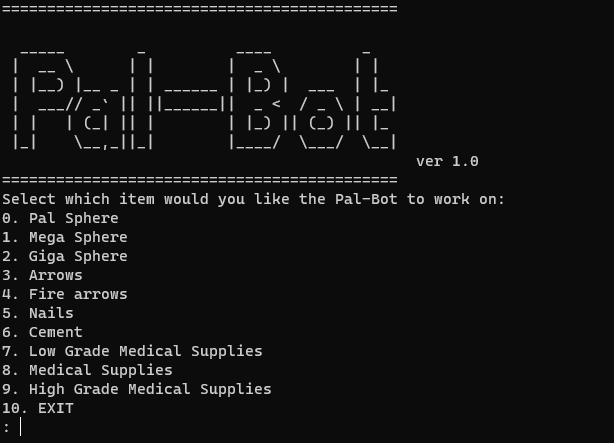

# Pal-Bot
A simple bot that uses Template matching to make items for you in Palworld. **(PC only)** 

### Demo
Pal-Bot currently can identify and make the following items
 - Arrows 
 - Fire arrows
 - cement
 - Nails
 - Low Grade Medical Supplies
 - Medical Supplies
 - High Grade Medical Supplies
 - Pal Spheres
 - Mega Spheres
 - Giga Spheres


### Usage
**Note: Highly recommend you have a seperate monitor to start the script on, as the script uses screenshots of the primary monitor to identify the items. Another thing to note, currently the bot will assume you have the materials needed to make the item and will choose to make the maximum amount of that item.**

To start, ensure you in the menu of the workbench that contains the items that you want the bot to make. 



Open up the terminal inside the repo and run the following command to start up the virtual python environment. 

```
.\.venv\Scripts\activate
```

Start up the python bot by typing
```
python main.py
```

The following menu should appear in the terminal, select which item you would like to have the bot make and sit back and relax~~


### Future work

 - Allow user to select how many items should be made 